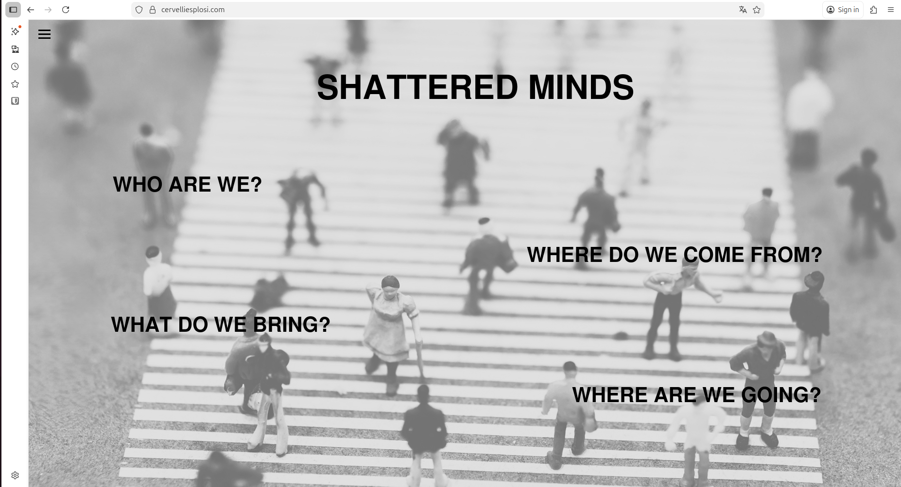
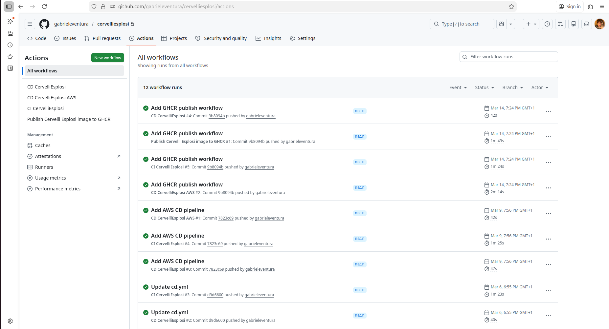
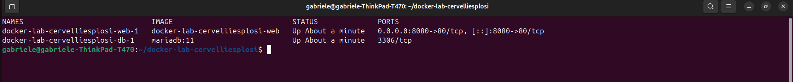
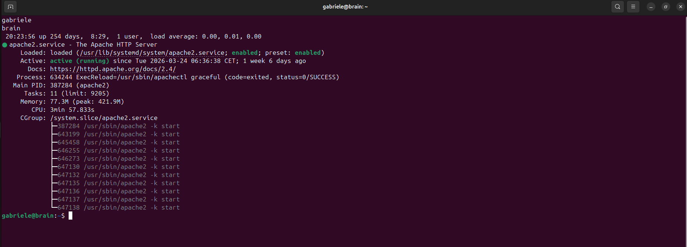

# Shattered Minds — Self-hosted Web Platform | DevOps & Infrastructure Project

A self-initiated project focused on designing, deploying, securing, and operating a production-like web platform across Linux servers and cloud environments.

This project reflects hands-on experience with real infrastructure, including application deployment, containerisation, CI/CD pipelines, security hardening, and monitoring.

---

## Overview

The platform consists of a custom-built web application deployed on Linux servers, with a full stack including:

- Apache / PHP web server
- MariaDB database 
- File upload system with persistence 
- Secure HTTPS configuration 
- Deployment across local, self-hosted (Hetzner), and AWS EC2 environments 

The project evolved from a simple web deployment into a broader DevOps lab, incorporating containerisation, automation, and monitoring.

---

## Screenshots

Real examples from the platform, infrastructure, and deployment workflow:

### Application


### CI/CD Pipeline (GitHub Actions)


### Docker Environment


### Server (Linux / SSH)


---

## What I Built

- Designed and operated a Linux-based web platform from scratch 
- Deployed and managed environments on both self-hosted servers and AWS EC2 
- Implemented CI/CD pipelines using GitHub Actions to build and push Docker images 
- Built and managed Docker images with versioned tags for reproducible deployments 
- Deployed containerised applications to a Kubernetes (k3s) cluster 
- Configured secure image pulls from private registries (GHCR) 
- Tested Kubernetes self-healing by simulating pod failures 
- Automated deployment and configuration tasks using Ansible 
- Developed local Docker environments to ensure consistency across environments 

---

## Architecture (simplified)

```text
GitHub (source code)
        ↓
GitHub Actions (CI/CD)
        ↓
Docker Images (GHCR)
        ↓
Deployment targets:
   - AWS EC2 (k3s cluster)
   - Self-hosted server (Hetzner)
        ↓
Web Application (Apache/PHP + MariaDB)
```
---

## Security & Hardening

- HTTPS with proper certificate configuration 
- HSTS and strict Content Security Policy (CSP) 
- Secure HTTP headers (X-Frame-Options, etc.) 
- SSH hardening 
- UFW firewall configuration 
- Fail2Ban intrusion prevention 

---

## Monitoring & Observability

- Log collection using Filebeat 
- Security and event monitoring with Wazuh 
- Network-level visibility using Suricata 
- Analysis of logs to detect anomalies and potential threats 

---

## Key Challenges & What I Learned

- Debugging deployment issues across different environments 
- Managing consistency between local, cloud, and self-hosted setups 
- Handling private container registry authentication in Kubernetes 
- Understanding container lifecycle vs persistent data 
- Applying real-world security hardening beyond default configurations 
- Structuring infrastructure in a reproducible and maintainable way 

---

## Repository Structure

```text
/app       → application code (web platform)
/docker    → Dockerfiles and build configuration
/ansible   → automation playbooks
/k8s       → Kubernetes manifests
/docs      → architecture, notes, experiments
```

---

## Why This Project

This project was built as a practical, hands-on path into DevOps and infrastructure engineering, focusing on real-world systems rather than isolated tutorials.

It reflects an end-to-end approach:

from writing application code → to deploying, securing, automating, and monitoring it in realistic environments.

---

## Links

- Live platform: https://cervelliesplosi.com
- Application code (web platform): https://github.com/gabrieleventura/cervelliesplosi 
